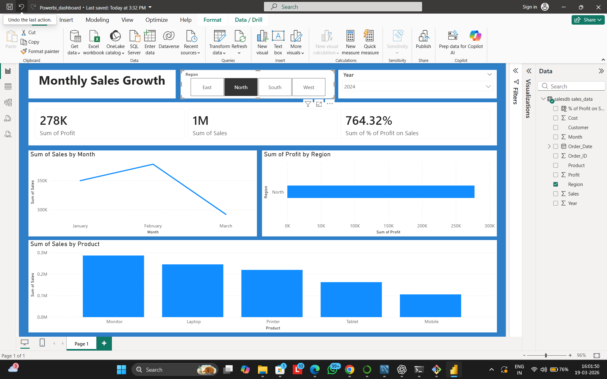

#  Sales Analysis Project

## 🔹 Overview

This project performs end-to-end sales data analysis, starting from raw Excel data to interactive dashboard visualization. The objective is to extract meaningful insights and support data-driven decision-making.

## 🔹 Tools & Technologies

* Excel (Data Source)
* Python (Pandas, Jupyter Notebook)
* SQL (MySQL Workbench)
* Power BI (Dashboard Visualization)

## 🔹 Project Workflow

1. Collected raw sales data from Excel
2. Cleaned and preprocessed data using Pandas
3. Removed duplicates and handled missing values
4. Imported cleaned data into MySQL database
5. Performed SQL queries for analysis
6. Built interactive dashboard in Power BI

## 🔗 Workflow Pipeline

Excel → Pandas → SQL → Power BI

##  Dashboard Preview

**Key Metrics Displayed:**
- Total Sales and Profit
- Regional Performance (North, East, West, South)
- Product-wise Sales Distribution
- Time-based Sales Trends

##  Dashboard Description

The Power BI dashboard provides a comprehensive overview of sales performance across regions and products. It highlights key metrics such as total profit, sales trends, and product performance.

* 📈 North region generated the highest profit in 2024
* 🏆 North region outperformed East, West, and South
* 🖥️ Monitor is the most sold product

## 🔹 Key Insights

* 📈 The North region recorded the highest total profit in 2024
* 🏆 Profit in the North region is higher compared to East, West, and South
* 🖥️ Monitor is the top-selling product, indicating strong demand

## 🔹 Project Structure

Sales-Analysis/

* data/ → raw and cleaned datasets
* notebook/ → Jupyter Notebook analysis
* sql/ → SQL queries
* dashboard/ → Power BI file

## 🔹 Conclusion

This project demonstrates the complete data analysis workflow, from data cleaning to visualization, and helps in understanding business performance through actionable insights.

## 🔹 Future Improvements

* Add predictive analysis (sales forecasting)
* Automate data pipeline
* Enhance dashboard interactivity

## 🔹 Author

Deepanshu Sharma

